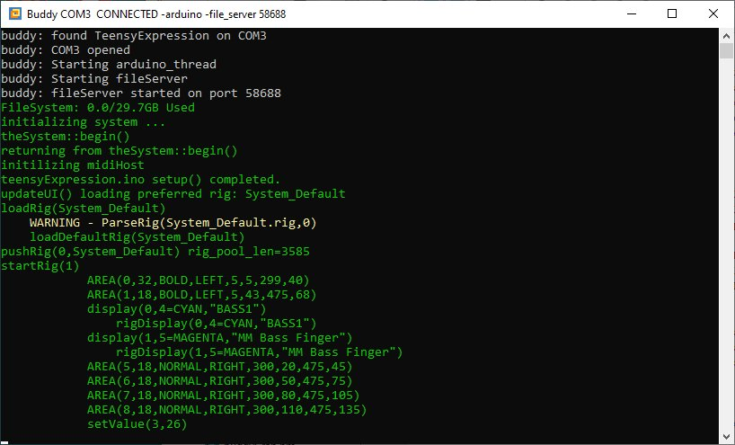
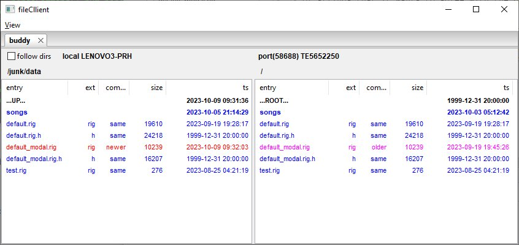
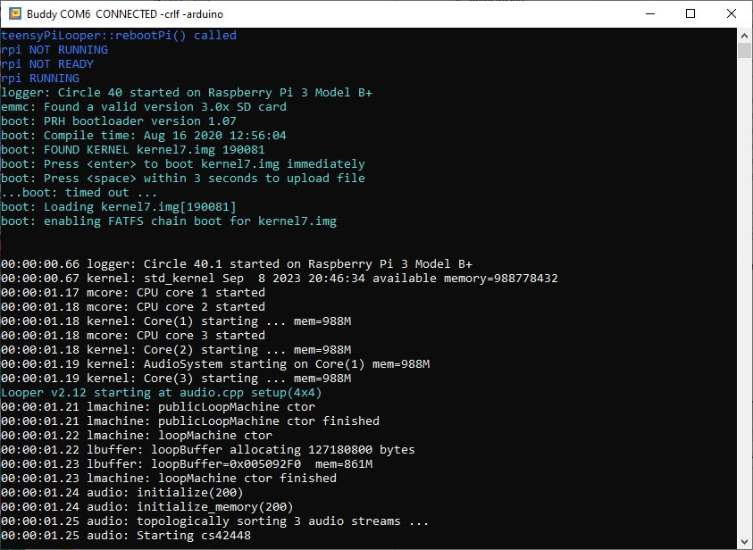
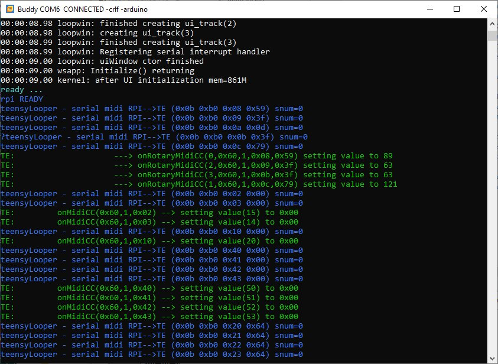
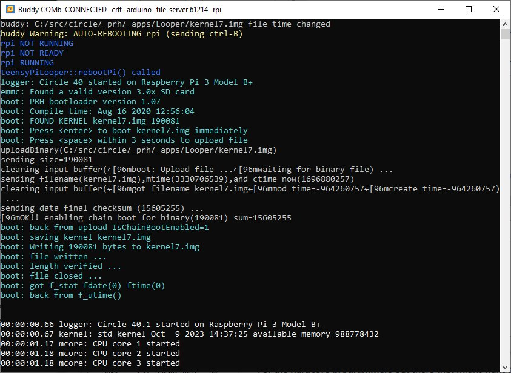

# Buddy

Buddy is a general Serial Port and Telnet monitor with many additional features.
In addition to the source code for Buddy, this repository includes a
[**Windows Installer**](https://github.com/phorton1/base-apps-buddy/tree/master/releases)
to install a completely ready-to-run version of the program on any *Microsoft Windows*
machine. Buddy is completely *Open Source Pure Perl*. Some key features of
Buddy include:

- displays **ANSI colors**
- works with the **Arduino IDE** and it's build process
- does automatic *rPi* binary *.img* uploads to the
  [**circle-bootloader**](https://github.com/phorton1/circle-prh/tree/master/bootloader)
- works as a
  [*fileServer*](https://github.com/phorton1/base-Pub/tree/master/FS) to the
  [**fileClient**](https://github.com/phorton1/base-apps-fileClient) Windows application
  that is automatically installed along with Buddy

Here is a screenshot of Buddy connected to the
[teensyExpression pedal](https://github.com/phorton1/Arduino-teensyExpression)
showing the output from Buddy itself in **white**, and showing the debugging
output from TE in <b>green</b> with a *Warning*
shown in <b>yellow</b>:

Buddy is built around the Windows Console (Dos Box) and can display ANSI colors
encoded as escape sequences.  Buddy intercepts various CTRL key combinations,
like CTRL-C to exit, and CTRL-D to clear the screen. Apart from these special
CTRL sequences, everything else that is typed in is sent to the COM
(or Telnet) port unchanged.

Buddy started life as a substitute for the Arduino IDE Serial Monitor. Buddy can
monitor the IDE and close and re-open the COM port as necessary to enable the Arduino
IDE to upload code over the COM Port during a build.

Buddy also very specifically can upload rPi *.img* files to a Raspberry Pi running
my bare-metal
[rPi bootloader](https://github.com/phorton1/circle-prh/tree/master/bootloader),
which is part of the
[rPi circle-prh](https://github.com/phorton1/circle-prh) bare-metal OS effort,
from which I developed the
[**Audio Looper**](https://github.com/phorton1/circle-prh-apps-Looper)
box and application that I use with my electric guitar for live looping.

The Windows installation of Buddy.exe also includes the installation of
[**fileClient.exe**](https://github.com/phorton1/base-apps-fileClient), which
can work with Buddy to provide a nice Windows application
to transfer files to and from the SD Card on *Arduino-like* devices. This
ability was *specifically built* to allow the transfer of **rig files** to
and from the
[**teensyExpression**](https://github.com/phorton1/Arduino-teensyExpression) pedal,
which in turn, also works closely with the
[Looper](https://github.com/phorton1/circle-prh-apps-Looper) in my live performance setup.

## 1. Command Line

As a simple example, the following command line opens Buddy to COM3 at 115200 baud,
and watches out for Arduino IDE builds:

	> buddy 3 115200 -arduino

At least one of the following four options **must** be provided:

- **COM_PORT** - a number by itself on the command line that is less than 100
- **IP_ADDRESS[:PORT]** - something that looks '192.168.0.100' with an optional colon and port number
- **-auto** - tells buddy to try to find a COM port to open and/or use SSDP to find a network (myIOT) device to connect to
- **-auto_no_remote** - auto without the SSDP search

The **default command line** for the *installed* version of Buddy is **-auto**.
The rest of the command line optiona include:

- **BAUD_RATE** - a number like *9600* or *115200*, defaults to 115200
- **-crlf** - outputs the CR or LF as needed when it receives only one of them from the port
- **-arduino** - watches for Arduino IDE builds and temporarily closes the COM port while they are happening
- **-rpi** - turns on the **rPi  auto-uploading** feature, described below
- **-file_server** - turns on the *Serial File Server* feature to work with the **fileClient** as described here
- **-file_client** - starts the **fileClient** automatically after starting the *Serial File Server*.

## 2. Automatic Searching for COM Ports and Network Devices

If **-auto** is specified on the command line, buddy will look for any
COM ports and/or SSDP (network) devices that it can connect to.  The
details of how those searches happen can be found in
[ComPorts.pm](https://github.com/phorton1/base-Pub/tree/master) and
[SSDPScan.pm](https://github.com/phorton1/base-Pub/tree/master).

The order of priorities is as follows:

- if Buddy finds a **teensyExpression** on a COM port, it will
  open that COM port and add "**-file_server**" to the command line.
- If Buddy finds an **Arduino-like** device on a COM PORT, which
  includes most Arduinos and compatibles, ESP32s, teensies, and so on,
  it will open that COM port and add "**-arduino -crlf**" to the command
  line.
- If Buddy finds a
  [**myIOTDevice**](https://github.com/phorton1/Arduino-libraries-myIOT)
  via SSDP, which would include any of my
  [Clocks](https://github.com/phorton1/Arduino-theClock3) and the
  [bilgeAlarm](https://github.com/phorton1/Arduino-bilgeAlarm), it
  will open a *telnet* session to the device by adding the appropriate
  "**IP_ADDRESS:PORT -crlf**" to the command line.
- And finally, if nothing else has been found, and Buddy finds
  **any open COMM port**, it will open just open that at the
  default or given BAUD_RATE.

If **-auto** is used, and Buddy can find nothing to connect to,
it will **exit**.

## 3. Summary of CTRL Keys

While you are connected to a device with Buddy, certain **CTRL** keys
will be intercepted by Buddy and **not sent** to the device. Here is
a list of the CTRL keys that Buddy responds to

- **CTRL-C** - exits Buddy
- **CTRL-D** - clears the Screen
- **CTRL-E** - pops up the [fileClient](https://github.com/phorton1/base-apps-fileClient)
  if using **-file_server** or **-file_client** command line options
- **CTRL-X** - initiates an **upload** of a *.img* to the
  [**rPi**](https://github.com/phorton1/circle-prh/tree/master/bootloader)
  if using the **-rpi** command line option

In addition **CTRL-B** is **reserverd** for use *by* Buddy although it is
per-se, not filtered or interpreted by Buddy.

## 4. the fileClient

When you install Buddy with the
[Windows Installer](https://github.com/phorton1/base-apps-buddy/tree/master/releases),
it also installs an executable (EXE) for the [fileClient](https://github.com/phorton1/base-apps-fileClient).

Although the *fileClient* is a stand-alone general purpose **User Interface** to any
*fileServer* implemented using my [Pub::FS](https://github.com/phorton1/base-Pub/tree/master/FS)
architecture, it has a special relationship to Buddy.  If you had connected to the
[teensyExpression](https://github.com/phorton1/Arduino-teensyExpression) pedal, as
shown in the *above example window*, and then pressed **CTRL-E** (or had specified
**-file_client** on the command line) the fileClient would **pop up**, looking something
like this:

This window allows you to transfer files to and from the your *Windows* machine
(from the **/junk/data** directory) to the *SD Card* in the
[teensyExpression](https://github.com/phorton1/Arduino-teensyExpression).
The *left* pane shows the files on the Windows machine and the *right*
pane shows the files on the SD Card.

Files that have the same *timestamp and size* are shown in <b>blue</b>.

In this example, the file **default_modal.rig** on the Windows machine is
**newer** than the one on the SDCard, and
shown in <b>red</b>, whereas the file on the SD Card
is **older** and shown in <b>magenta</b>.
This use of **colors** allows you to easily identify files that need
to be transferred from one machine to the other.  By **right clicking**
on the *default_mnodal.rig* file you can select *Transfer* to 'upload'
the file from the Windows machine to the SDCard in the teensyExpression.

Please see the [documentation](https://github.com/phorton1/base-apps-fileClient)
on the **fileClient** for more detailed information on how to use it.

## 5. myDebug Arduino library

It is difficult to explain how I have put **over 10 years** into the devalopment
of Buddy and the associated programs (repostitories) I have linked to from this page.

In general, any **Arduino-like** programs I write, including everything from
simple Arduino-nano things like the [Useless Box](https://github.com/phorton1/Arduino-useless),
to more complicated things like [my IOT architecture](https://github.com/phorton1/Arduino-libraries-myIOT)
and the [teensyPi](https://github.com/phorton1/Arduino-teensyPi) and
[teensyPiLooper](https://github.com/phorton1/Arduino-teensyPiLooper) interfaces
to **Raspbery Pis**, all make use of my
[**Arduino debugging output library**](https://github.com/phorton1/Arduino-libraries-myDebug).

That library make it simple to **display** things in **different colors** and at
procedural **indentation levels**, even on devices with very little memory, like
an Arduino Nano.  I use different colors to be able to distinguish the output from
whole **chains of programs** that might be outputting to a serial port monitoried
by Buddy.

For example, the *teensyExpression pedal*, which is running on a **teensy3.6**,
can be connected to the *Looper*, which is, itself, running on a **Raspberry Pi**.
The serial output for both of those is mediated by the *teensyPiLooper.ino*, program which
is running on yet another **teensy 3.2**.  By connecting Buddy to the USB port
on the teensyPiLooper (which is otherwise unused by the whole setup), I
can monitor the output from **all three programs**, with each program having
a distinctive *color*, and effectively debug them all, and their interactions,
in **one window**, over **one USB cable** to my laptop.

To show how complicated this can get, here is a window showing the startup debugging
for the **Looper**.  The *teensyPiLooper* responds to **CTRL-B** typed into Buddy
by rebooting the Raspberry Pi running the *Looper*.

.

The <b>blue</b> messages at the top of the window
are from the *teensyPiLooper.ino* program running on the teensy 3.2. It responds
to the CTRL-B by setting the Raspberry PI **Run Pin** to a low state, causing
the rPi to reboot. *teensyPiLooper* also monitors that pin, so it outputs the
<b>"rpi NOT RUNNING"</b> message.

*teensyPiLooper*  also monitors
another pin on the rPi that I call the **Ready Pin**, which signifies if the rPI
(and *circle* and the *Looper*) have completed their boot sequence. Upon
a reset, that pin also goes low and so the teensyPiLooper displays the
<b>"rpi NOT READY"</b> message.  After a few
seconds, the rPi reboots, the *Run Pin* goes high, and teensyPiLooper
displays the <b>"rpi RUNNING"</b> message as
the *Run Pin* goes high after the rPi initially boots.

Then in <b>cyan</b> the Looper starts outputting
*Info* level output (as oppossed to *Debug* level output).  This section
shows the *bootloader* as it finds the *.img* to load, allows for
an alternative *.img* upload to begin within 3 seconds, and then
proceeds to start the .img from the SD Card on the Raspberry pi.

Following that, in **white** there are debugging messages from *circle*
and the *Looper* as it starts the multi-core *Audio Subsystem*, the
*loopMachine*, and other things that go into the running *Looper*.

The second window, below, shows the end of the boot sequence and some
behavior of the *teensyExpression* pedal as it is notified of the
reboot by *serial MIDI messages* sent to it from the looper.

.

After the **white** Looper startup debug messags, the Looper outputs
the <b>cyan "ready ..."</b> message as it
raises the *Ready Pin* to a high state.

*teensyPiLooper* then notices that the *Ready Pin* has gone high and outputs
the <b>blue "rpi READY"</b> message.

*teensyPiLooper* then forwards a series of *serial midi messages*,
shown in <b>blue</b>. that
the Looper outputs upon startup, to the teensyExpression.

In <b>green</b> we then see a series of
debug messages from the *teensyExpression* (TE) itself as it receives
those serial MIDI messages and passes them on to it's **onRotaryMidiCC()**
method.

So, you can see how the *colors* available in **Buddy** makes it possible for
me to debug, understand, and work on these very complicated interconnected
programs.  It would be very difficult to *see* and *understand* what is
happening if everything was just an un-indented series of plain white text!

An **amazing** detail (or should I say a *further complicated implementation
detail*) is that, even with this setup, where the *laptop* is
connected to the *teensyPiLooper* via a **USB cable**, and the *teensyExpression*,
as well as the rPi running the *Looper*, are both connected to the teeensyPiLooper's
2nd and 3rd serial port(s) via pairs of **wires between GPIO pins**,
we can <u><b>still</b></u> use the **fileClient UI** to transfer files to and from the
*teensyExpression*, **upload new .img** files (i,e, the *Looper Program*) to the *rPI*
(as described below), as well as **build and upload** new versions of *teensyPiLooper,ino* fron
the *Arduino IDE*, ***ALL without changing any wires or cables*** !!

*Note that to use the **fileClient** in the complicated scenario described here,
in addition to **-file_server** or **-file_client**, you must also specify **-rpi**
on the Buddy command line.*

## 6. rPi Automatic Kernel Upload feature

We can now describe how the **rPi Automatic Kernel Upload** feature works.
This feature works between *Buddy* and the
[*circle-bootloader*](https://github.com/phorton1/circle-prh/tree/master/bootloader),
and is mediated by the *teensyPiLooper* or *teensyPi.ino* program.

When the *circle bootloader* begins, we have already seen from the above
example that it outputs a message at startup that looks like this:

	boot: Press <space> within 3 seconds to upload file

The feature is built around the fact that, if **-rpi** is specified on the command line,
then Buddy watches for this message, and if the appropariate **kernel.img on the local
Windows machine** has **changed**, when it sees the message,
it will upload the new *kernel,img* to the rPi, through the *teensyPi* program,
using a custom *binary serial file transfer protocol* that I created for
this purpose, and the bootloader will write it to the rPi's SD card.
The rPi then reboots.

If there's any problem with the kernel, the reboot will fail, but as long
as the bootloader is intact, you can repeat this process until you get
a working kernel on the rPi.

The key phrase in the preceeding paragraph is "*if the kernel has changed*".

To orchestrate this change detection **two** files are involved.  One
is the *kernel.img file itself*, and the other is a **registry file** that
tells Buddy where to find the *kernel.img* on your machine.

### Kernel Registry File

The *registry file* consists of one line of text ... a **fully qualified
filename of a kernel.img** someplace on your machine.

When **-rpi** is specified, Buddy gets the **datetime stamp** of both files
at startup, and assumes that nothing has changed. In a separate thread, every
second, Buddy checks if the **datetime stamps** on either of the files has changed.

If the datetime of the *registry file* has changed, and the *fully qualified
path in it has changed*, then Buddy thinks a new kernel has been specified, gets
their datetime stamps as it did at startup, and acts like nothing has changed.

However, if the *kernel.img* datetime **has changed**, then Buddy will do the
following:

- Buddy will issue a **CTRL-B** to the *teensyPi* or *teensyPiLooper*
  which those programs use to bring the *Run Pin* low in order to
  **reboot the rPi**.
- then, when the rPi reboots, Buddy will see the
  *"Press <space> within 3 seconds to upload file*" message, and
  since the kernel.img timestamp has changed, will initiate the
  serial file protocol to transfer it (through the teensyPi/Looper)
  to the rPi.
- Buddy then resets its notion of the datetime for the kernel.img
  and continues watching for changes.

### Screenshot

This process is shown in the following Buddy screen shot.

The only question remaining is "**where is the registry file
and what is its filename?"**.  For legacy reasons, and because
I'm generally lazy, so that I didn't have to change my own development
environment for the few people that might end up using this feature, the
registry_filename defaults to **"/base_data/console_autobuild_kernel.txt"**.

### BUDDY_KERNEL_REG Environment Variable

I might change that in future releaes, but for now,
unless you want to create a file called */base_data/console_autobuild_kernel.txt*,
**in order to use this feature you will need to set a Environment
Variable**

	BUDDY_KERNEL_REG = %USERPROFILE%\Documents\buddy\kernel_reg.txt

This will set the name of the kernel registry file to **kernel_reg.txt**
in the **Buddy data folder** in your **Documents** folder. Note that
the *contents* of this file (the single fully qualified path to a
kernel.img) are in *unix format*, that is, they use forward slashes
'/' instead of back slashes '\' as the path seperator.

### Summary of rPi Automatic Kernel Upload feature

To complete this section, let's say you were building a new kernel.img
that would be found at **/src/circle/_prh/apps/Looper/kernel7.img**.
Then **Documents/kernel_reg.txt** would contain one line:

	/src/circle/_prh/apps/Looper/kernel7.img

With **-rpi** specified on the command line, Buddy would watch for
changes to this file.  When you perform a **make** (however you do it)
and the kernel7.img datetime changes, Buddy would notice it, and
upload the image to the rPi as described above.

My development environment allows me to try and upload different kernels
for different programs, for instance a debug versus a release version of
the Looper, or perhaps a small test diagnostic program (kernel) as I wish,
by rewriting the registry file when I change the program I am compiling.
I sometimes have to **make** it twice to trigger the automatic upload,
but generally this scheme has saved me many, many, hours where, otherwise,
I would have had to remove the rPi SDCard, insert it in my laptop, copy the
new kernel.img to it, put it back in the rPi, and reboot the rPi,
dozens, or sometimes even hundreds of times per day.

*Note: I also use this feature to upload new versions of the **bootloader**
to the rPi.  The bootloader uses a different image filename than the kernel
that it loads. However, if the bootloader fails for some reason, and the
rPi won't boot, I then need to manually remove the SDCard, put it in my
laptop, and copy a new working bootloader image to the card by hand.*

## 7. All Environment Variables used by Buddy

As with the *BUDDY_KERNEL_REG* environment variable above, there are
a few other Environment variables that can be set to alter Buddy's
behavior for situations and futures that I cannot completely anticipate.

- **BUDDY_KERNEL_REG** - as mentioned above, this sets the *Kernel Registry Filename*
  used by Buddy.
- **BUDDY_ARDUINO_NAME** - this is the name of the *process* that Buddy looks
  for to determine if an Arduino IDE build is underway so that it can close
  and re-open the COM port.  The default is **"arduino-builder.exe"** but can
  be changed via an ENV var in case that changes in future version of the IDE.
- **BUDDY_ARDUINO_SEM** - this is the name of a file somewhere, that if present
  will also cause Buddy to close and re-open the COM_PORT.  The default is
  **"/junk/in_upload_spiffs.txt"** and I use it to close the COM port while
  uploading new **SPIFFS file system** images on ESP32's.

## 8. Perl and Design Details

Besides being run as EXE files from the Windows Installer, for developers,
*Buddy* and *fileClient* can be run directly from the **Perl source** in this
and the associated project directories.  Please see my
[Strawberry Perl](https://github.com/phorton1/Strawberry) repository for
an example of how to install a **Wx enabled** Perl Interpreter with the
required *Perl Modules* in order to run these programs.

Otherwise, for more design details about Buddy, please
see the [**Design Document**](design.md).

## 9. License

This program is free software: you can redistribute it and/or modify
it under the terms of the GNU General Public License Version 3 as published by
the Free Software Foundation.

This program is distributed in the hope that it will be useful,
but WITHOUT ANY WARRANTY; without even the implied warranty of
MERCHANTABILITY or FITNESS FOR A PARTICULAR PURPOSE.  See the
GNU General Public License for more details.

Please see **LICENSE.TXT** for more information.

---- end of readme ----
